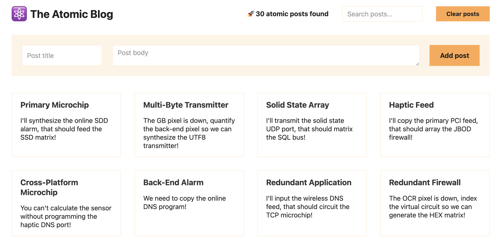

# REACT Atomic Blog

 The Atomic Blog is a small app that shows a number of "Blog Entries", which are basically like post-its with a title and some text.  

You can filter the list, add new posts, and clear the list as well. 

This app was constructed as part of the [Ultimate React Course](https://www.udemy.com/course/the-ultimate-react-course/) on Udemy.com by [Jonas Schmedtmann](https://www.udemy.com/user/jonasschmedtmann/?kw=Jonas+Schmedtmann)

## React Features Demonstrated

Demonstrates Several React Features Including:

* React Context API

## 3rd Party APIs and Features

* Uses "Faker.js" to generate blog titles and text

  * [Faker.js HomePage](https://fakerjs.dev/)

  * [GitHub:Faker-JS](https://github.com/faker-js/faker)

    

## Setup and Running
In order to run this app you will need the following

1. Install [Node.js](https://nodejs.org/en) for local development.
1. run npm install in the app folder
1. run npm start in the app folder
1. open a local browser at http://localhost:3000

## Create-React-App Readme
This app was bootstrapped using npx create-react-app@5 projectNameThe default readme for react apps is found at [ReadmeReact.md](./ReadmeReact.md)

## Markdown Syntax
This file is a Markdown file, which is a plaintext file that can be rendered into HTML and is capable of containing hyperlinks, images, tables and other formatting syntax. See the GitHub Document Writing page for more information.